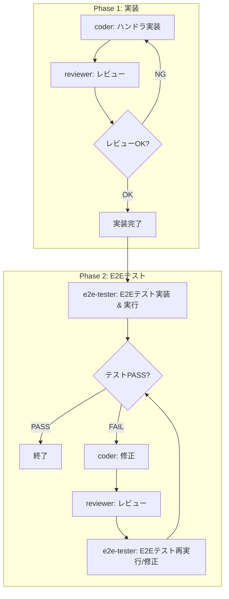

# /do-plan - プランに従って実装を行う

プランに従って実装を行うコマンド

## 実装フロー

### Phase 1: 実装

1. coder: ハンドラ実装
2. reviewer: レビュー
3. レビューNGなら 1 に戻る、OKなら Phase 2 へ

### Phase 2: E2Eテスト

**前提条件**: 対象ハンドラの実装が完了していること（E2Eテストが実装可能な状態）

4. e2e-tester: E2Eテスト実装 & 実行
5. テストPASSなら終了
6. テストFAILなら:
   - coder: 修正
   - reviewer: レビュー
   - e2e-tester: E2Eテスト再実行/修正
   - PASSするまで繰り返す

※ ハンドラ実装が未完了の場合は Phase 1 を継続し、Phase 2 には進まない

### フロー図

## subagent の使い分け

| subagent | 責務 |
|----------|------|
| coder | ハンドラ実装、単体テスト、修正 |
| reviewer | コードレビュー |
| e2e-tester | E2Eテスト実装、E2Eテスト実行 |

## タスクの進め方

- 親エージェントは subagent を効果的に利用してください
- 並列実行可能なタスク（変更範囲が被らず、依存関係のないタスク）があれば並列で実行

## break point

以下のタイミングで作業を止めてユーザーに確認を依頼してください。
確認を依頼する場合は develop を base ブランチとする PR を作成してください。

- プラグイン設定画面が完成し、E2Eテストが通った時
- 各ハンドラが完成し、E2Eテストが通った時
- 全てのハンドラが完成し、全E2Eテストが通った時

## テスト設計にミスがあり、修正が必要と判断したとき

- 人間に確認を依頼してください
