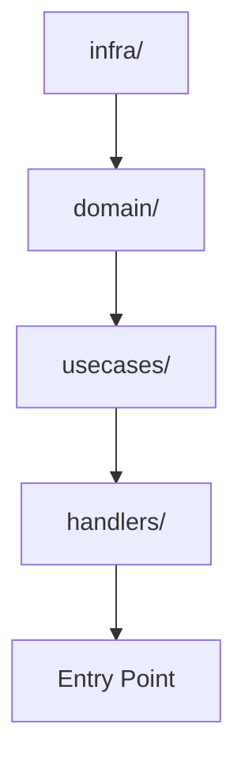

# 実装ガイド

## 実装順序

| 順序 | 対象 | 詳細 |
|------|------|------|
| 1 | インフラ層 | kintone API呼び出し関数 |
| 2 | ドメイン層 | ビジネスロジック |
| 3 | ハンドラ層 | イベントハンドラ |
| 4 | UI層 | Reactコンポーネント |
| 5 | E2Eテスト | 統合テスト |

## ファイル作成計画

### Phase 1: 基盤実装

```
src/
  └── functions/
      ├── infra/
      │   └── [API関数を列挙]
      └── domain/
          └── [ロジック関数を列挙]
```

### Phase 2: ハンドラ・UI実装

```
src/
  ├── functions/
  │   └── handlers/
  │       └── [ハンドラを列挙]
  ├── components/
  │   └── [コンポーネントを列挙]
  └── hooks/
      └── [フックを列挙]
```

### Phase 3: テスト実装

```
tests/
  └── e2e/
      └── [テストファイルを列挙]
```

## 技術的判断事項

設計時に決定した技術的判断を記載:

| 判断項目 | 選択肢 | 決定 | 理由 |
|----------|--------|------|------|
| [項目名] | A / B | [選択] | [理由] |

## 依存関係



## 注意事項

- [実装時の注意点を列挙]
