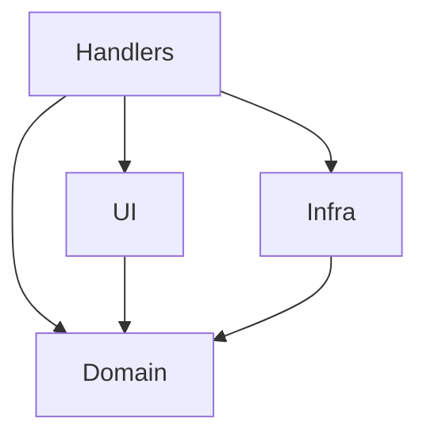

# アーキテクチャ (Architecture)

**Simplified Hexagonal Architecture** を採用し、ロジックとインフラ・UI を分離します。

## ディレクトリ構造 (Directory Tree)

```
src/
  ├── components/
  │   └── ui/          # UI Components
  ├── functions/
  │   ├── domain/      # Business Logic
  │   ├── infra/       # Adapters / API Client
  │   └── handlers/    # Event Handlers
  └── pages/           # Entry Points
      ├── desktop/
      └── config/
```

## 各レイヤーの定義 (Definitions)

### 1. Domain Layer (`functions/domain`)

- **役割**: 純粋なビジネスロジック。
- **特徴**: kintone API や UI ライブラリに依存しない。純粋な TypeScript 関数。
- **テスト**: 外部依存をモックすることなく、高速な単体テストが可能。

### 2. Infra Layer (`functions/infra`)

- **役割**: 外部との通信アダプター。
- **特徴**: kintone REST API クライアントや外部 API 呼び出しの実装。
- **関係**: Domain 層で定義されたインターフェース（必要な場合）を実装する形が望ましい。

### 3. UI Layer (`components/ui`)

- **役割**: ユーザーインターフェース。
- **特徴**: React コンポーネント。状態管理と表示を行う。
- **関係**: Domain ロジックを呼び出して計算や判定を行う。直接 kintone API を呼び出すことは避ける（Infra 経由か Hooks 経由）。

### 4. Handler Layer (`functions/handlers`)

- **役割**: kintone イベントの受け口（Controller）。
- **特徴**: `app.record.create.submit` などのイベントオブジェクトを受け取る。
- **関係**: イベントデータを整形し、Domain ロジックや UI 描画処理へつなぐ「糊（Glue）」の役割。

### 5. Entry Points (`pages`)

- **役割**: ビルドのエントリーポイント。
- **特徴**: 各種イベントハンドラの登録処理などを記述し、アプリケーションを起動する。

## 依存関係ルール (Dependency Rules)



1.  各々の層内での関数間の依存は許可する。
2.  `domain` は他のどの層にも依存してはならない。
3.  `ui`は`domain`にのみ依存してよい。
4.  `infra`は`domain`にのみ依存してよい。
5.  `handlers` は全ての層を利用してよいが、ロジック自体を実装してはならない。
